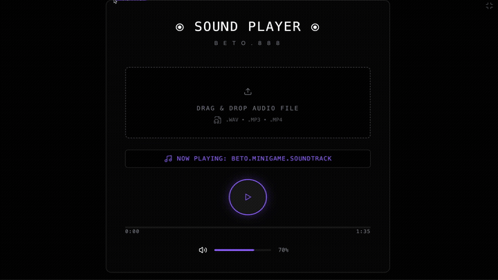

  
  
  <h1 align="center">SOUND PLAYER</h1>
  <h3 align="center"> Mᴏᴅᴇʀɴ Dɪɢɪᴛᴀʟ Aᴜᴅɪᴏ Pʟᴀʏᴇʀ </h3>

  <!-- TOP PURPLE LINKS -->
  
  
  
   
  <!-- BOTTOM GOLD TAXONOMY -->
  
  
  
  

<i>An interactive digital audio player featuring custom drag-and-drop song loading, timeline scrubbing, volume controls, and full-tab mode overlays.</i>

The Sound Player component provides an elegant audio execution layout in the Obsidian vault content pane. It defaults to playing a standard Beto minigame wav soundtrack, but allows users to drag and drop local audio files (WAV, MP3, MP4) directly onto the deck to switch tracks instantly.

## Features

- **🛡️ Runtime & Agentic Safety**: Configured with a polling watch daemon monitoring `data/mcp_commands.json` for hot reloading, and uses local cache helpers under `assets/cache/` to ensure offline stability.
- **🔐 Drag-and-Drop Loader**: Implements seamless system drag listeners supporting local file dropping and native Object URLs to parse and load external sound files.
- **📐 User Interface**: Features full-tab immersive DOM reparenting to override standard headers, glowing borders, custom progress range seeks, and volume percentage sliders.

## Directory Index & Components

The package exposes the following compiled files:

| File | Description |
| :--- | :--- |
| **[SOUND PLAYER.md](SOUND PLAYER.md)** | The main entry point note to be loaded in the Obsidian workspace leaf. |
| **[src/index.jsx](src/index.jsx)** | Main entry bootstrapper coordinating the watch reload daemon and FullTab style injection. |
| **[src/App.jsx](src/App.jsx)** | Main layout component managing the audio tags, states, and drag events. |
| **[src/components/AudioControls.jsx](src/components/AudioControls.jsx)** | Playback controls, dropzone UI, timeline slider, and volume handles. |
| **[src/utils/domUtils.js](src/utils/domUtils.js)** | DOM traversal helper functions to locate target leaf wrappers. |
| **[src/utils/loadScript.js](src/utils/loadScript.js)** | Offline caching local script loader. |
| **[METADATA.md](METADATA.md)** | Packaging manifest containing security, network, and indexing declarations. |
| **[CONTRIBUTION.md](CONTRIBUTION.md)** | Developer roadmap and layout rules. |
| **[LICENSE.md](LICENSE.md)** | MIT open-source license. |

## Contributors
- beto.group
